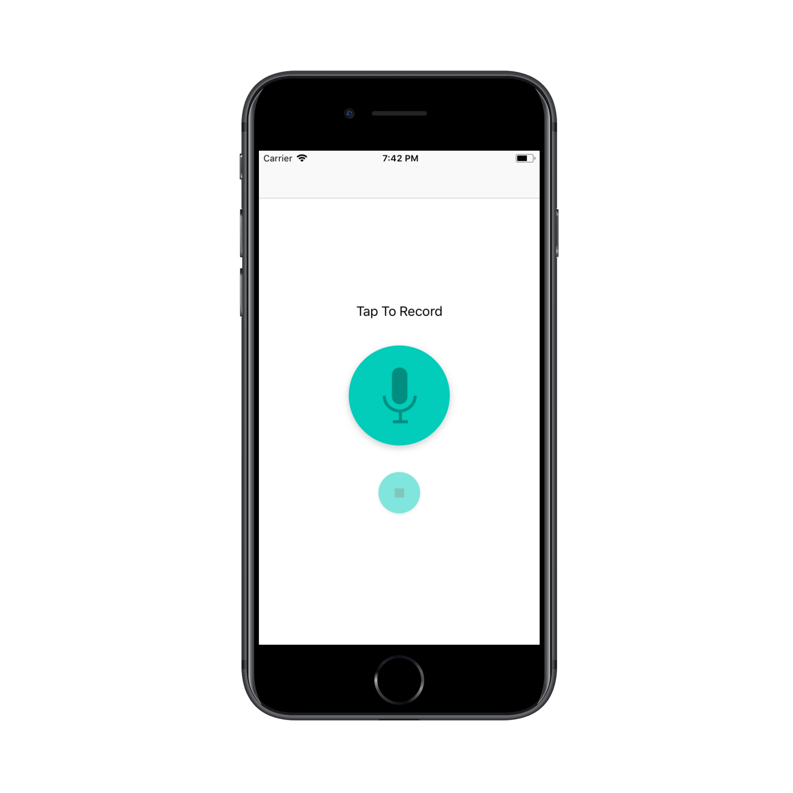
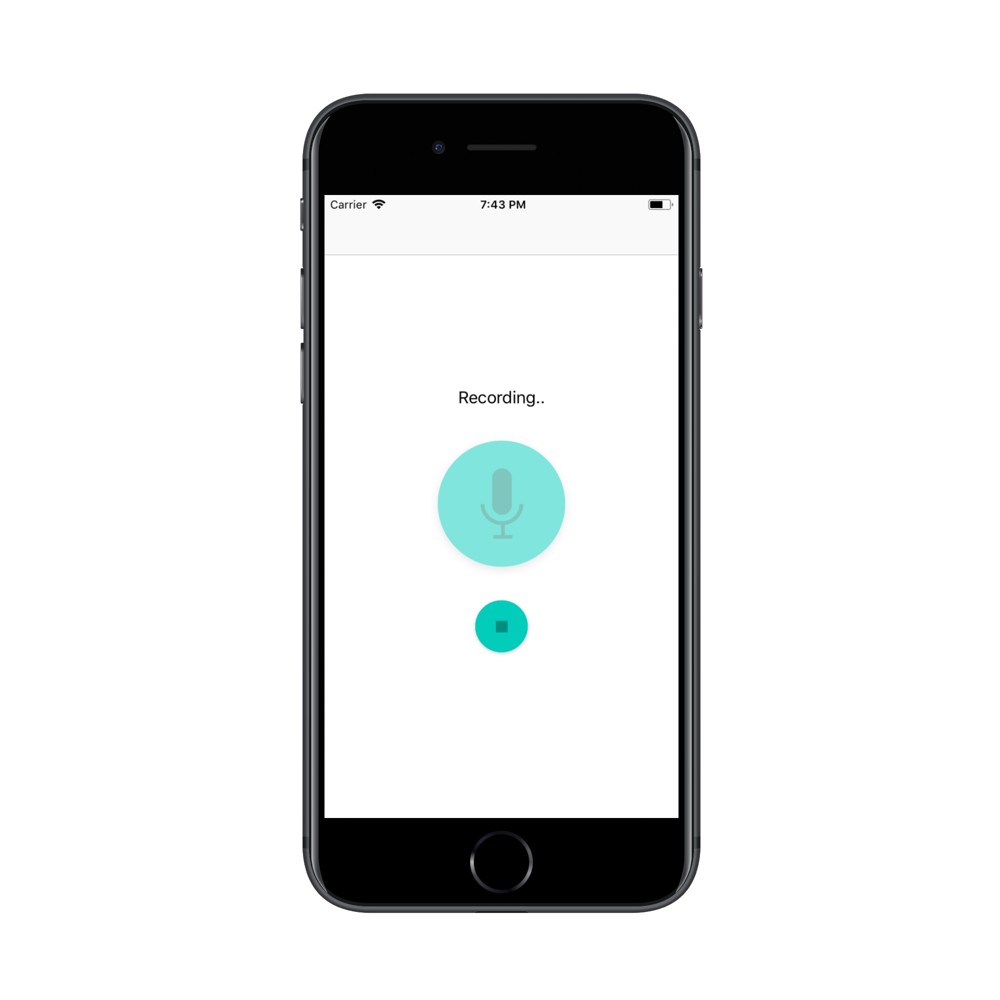
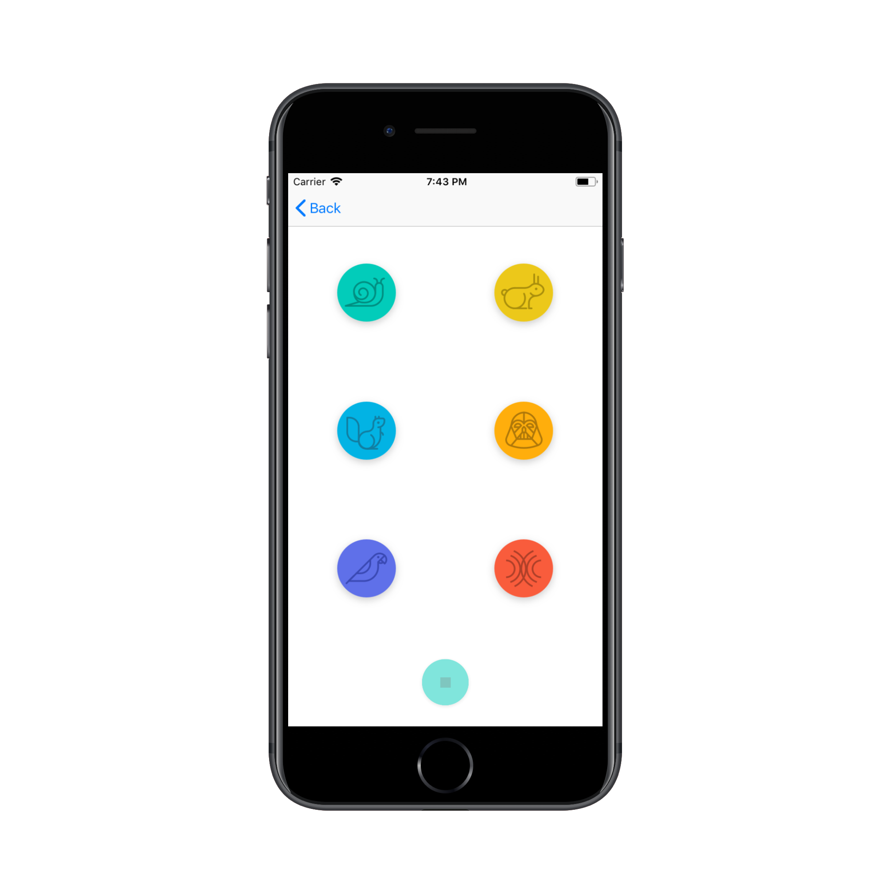

# PitchPerfect

### Udacity Project 1: Pitch Perfect iOS Developer Nanodegree

A simple AVFoundation app that uses your phone's microphone to record audio and then apply audio effects on the recording: slow speed, high speed, low pitch, high pitch echo, and reverb.

Basic features Based on the criteria found in here:

- [Project Rubric](https://docs.google.com/document/d/1LlcUT90j-ItbRQpB3ivLHwjP-KgKOUdoOLpz0WirpSo/pub?embedded=true)
## Screenshots
| Home Screen: Idle | Home Screen: Recording | Play Sounds Screen |
| ----------------- | ---------------------- | ------------------ |
|  |  | 
